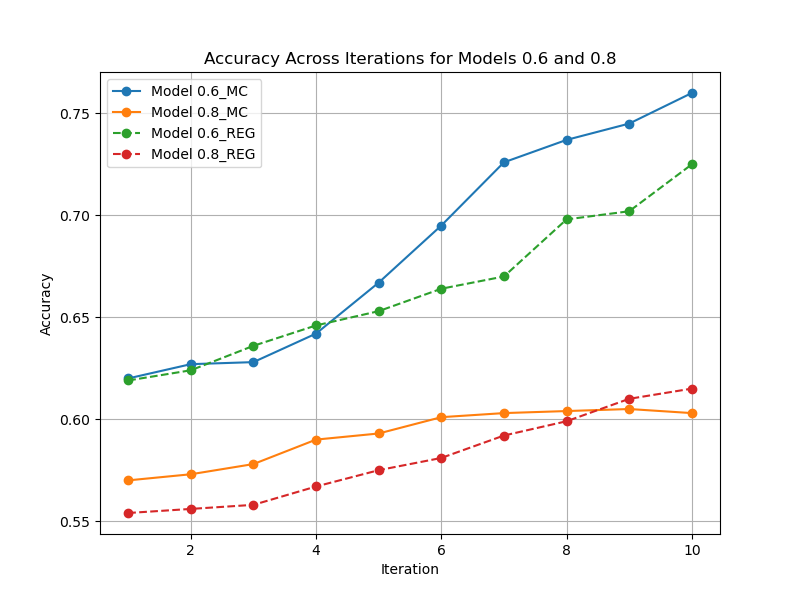

# Semi-Supervised Financial Time-Series Forecasting: LSTM-based Cryptocurrency Price Prediction with Monte Carlo Attention
A comprehensive framework implementing semi-supervised learning techniques for cryptocurrency price prediction, featuring LSTM networks with Monte Carlo attention mechanisms, pseudo-labeling strategies, and evaluation across multiple labeled data scenarios (60%, 80%, 90%).


# Semi-Supervised Cryptocurrency Price Prediction Framework

[](https://www.python.org/downloads/)
[](https://pytorch.org/)
[](LICENSE)

> A simple deep learning framework for cryptocurrency price prediction using semi-supervised learning with Monte Carlo attention mechanisms.

## 🎯 **Project Overview**

This project addresses the challenge of cryptocurrency price prediction in data-scarce environments by implementing a semi-supervised learning framework that achieves **moderate accuracy of 0.59 price movement classification** on previously unseen data samples and with only 80% labeled training data after just 10 training iterations.

### **Key Innovations:**
- 🧠 **Monte Carlo Attention LSTM**: Innnovative architecture combining bidirectional LSTMs with uncertainty-aware attention
- 🏷️ **Intelligent Pseudo-Labeling**: High-confidence sample selection using Monte Carlo dropout
- ⚡ **Scalable Architecture**: Processes 40+ cryptocurrency DAOs simultaneously

## 📈 **Results Highlights**

**On Training Data:**
**Without Monte Carlo:**
| Metric | 60% Labeled Data | 80% Labeled Data | 100% Labeled Data |
|--------|------------------|------------------|-------------------|
| **Accuracy** | 72.5% | 61.5% | 52.9% |
| **ROC-AUC** | 0.754 | 0.649 | 0.550 |
| **Avg. F1-Score** | 0.59 | 0.525 | 0.475 |

**With added Monte Carlo:**
| Metric | 60% Labeled Data | 80% Labeled Data | 100% Labeled Data |
|--------|------------------|------------------|-------------------|
| **Accuracy** | 76.0% | 60.3% | 52.8% |
| **ROC-AUC** | 0.891 | 0.903 | 0.912 |
| **F1-Score** | 0.57 | 0.52 | 0.48 |

**On Unseen Test Data:**
| Metric | 60% Labeled Data | 80% Labeled Data | 100% Labeled Data |
|--------|------------------|------------------|-------------------|
| **Accuracy** | 59.0% | 55.0% | 51.0% |
| **F1-Score** | 0.37 | 0.35 | 0.42 |



## 🚀 **Quick Start**

```bash
# Clone repository
git clone https://github.com/yourusername/semi-supervised-crypto-forecasting.git
cd semi-supervised-crypto-forecasting

# Install dependencies
pip install -r requirements.txt

# Run price movement prediction
python src/train_classifier.py --labeled_ratio 0.8 --epochs 60

# Run price regression
python src/train_regressor.py --labeled_ratio 0.8 --epochs 60
```

## 🏗️ **Architecture**

```
Input Data (40 DAOs) → Feature Engineering → LSTM Layers → Monte Carlo Attention → Prediction
     ↓                      ↓                    ↓              ↓                  ↓
Time Series Features → Preprocessing → Bidirectional → Uncertainty → Classification/
DAO Governance Data → Normalization → LSTM Network → Quantification → Regression
```

## 📊 **Dataset**

- **40 cryptocurrency DAOs** tracked over 2,3 years in average with 4,5 years max.
- **17 features** including governance activity, trading volume, technical indicators
- **120-day sliding windows** for temporal pattern recognition
- **Real-time data integration** via DeFi Llama and Coinbase APIs

## 🔬 **Methodology**

### **1. Semi-Supervised Learning Pipeline**
- Train LSTM classifier on labeled subset (60-90% of data)
- Generate pseudo-labels for unlabeled data using Monte Carlo sampling
- Select high-confidence predictions (>90% certainty) for augmented training
- Iteratively improve model performance

### **2. Monte Carlo Attention Mechanism**
```python
class MonteCarloAttention(nn.Module):
    def __init__(self, hidden_size, dropout_rate=0.5):
        super().__init__()
        self.attention = nn.Linear(hidden_size * 2, 1)
        self.dropout = nn.Dropout(dropout_rate)
    
    def forward(self, lstm_output):
        # Uncertainty-aware attention weights
        attention_scores = self.dropout(self.attention(lstm_output))
        attention_weights = torch.softmax(attention_scores, dim=1)
        return torch.bmm(attention_weights.transpose(1, 2), lstm_output)
```

## 🛠️ **Technical Skills Demonstrated**

- **Deep Learning**: PyTorch, LSTM networks, attention mechanisms
- **Machine Learning**: Semi-supervised learning, pseudo-labeling, ensemble methods
- **Data Engineering**: Time series processing, feature engineering, API integration
- **Financial Analysis**: Technical indicators, risk metrics, portfolio optimization
- **Software Engineering**: Modular code structure, testing, documentation

## 📝 **Research Paper**

Read the full research paper: [Financial Time-Series Forecasting with Semi-Supervised Learning](docs/research_paper.pdf)

**Abstract**: This study presents a novel semi-supervised learning framework for cryptocurrency price prediction...

## 🤝 **Contact**

**Lukas Beckenbauer**
- 📧 Email: lukas.beckenbauer@tum.de
- 🐙 GitHub: [github.com/hash00x1](https://github.com/hash00x1)

---

⭐ **If you found this project interesting, please consider giving it a star!**
